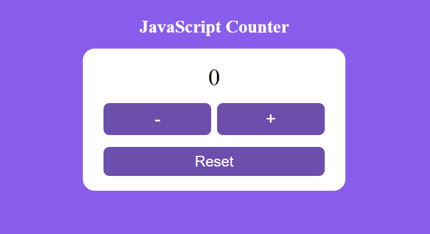

# StartToImpact: Counter JavaScript 
Questo progetto è un semplice esempio di come creare un contatore utilizzando JavaScript e HTML. Il contatore può essere incrementato cliccando su un pulsante.

<p align="center">
    
</p>

## Come funziona
Il contatore iniziale è impostato a 0. Cliccando sul pulsante "+", il contatore aumenterà di 1 e il nuovo valore sarà visualizzato sulla pagina. Cliccando sul pulsante "-", il contatore diminuirà di 1 e cliccando su "Reset" il contantore verrà riportato sullo 0.

## Come utilizzare il progetto
1. Clona il repository sul tuo computer:
   ```bash
   git clone https://github.com/lim-haru/counter-javascript.git